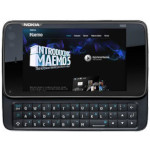

# Nokia N900

  
|Component|Description                      |
|---------|---------------------------------|
|CPU      |TI OMAP3430 Cortex-A8 600MHz     |
|GPU      |PowerVR SGX530                   |
|RAM      |256MB                            |
|Storage  |32GB                             |
|Screen   |3.5" 800x480 Resistive Touch     |
|Slot     |MicroSD                          |
|Keyboard |3 Rows QWERTY                    |
|USB      |Host and Client                  |
|Bluetooth|v2.0 + EDR                       |
|WLAN     |Wi-Fi 802.11 b/g                 |
|Battery  |3.7V 1320mA                      |
|Dimension|111mm x 60mm x 18mm              |
|Weight   |181g                             |

### https://steward-fu.github.io/website/index.htm
